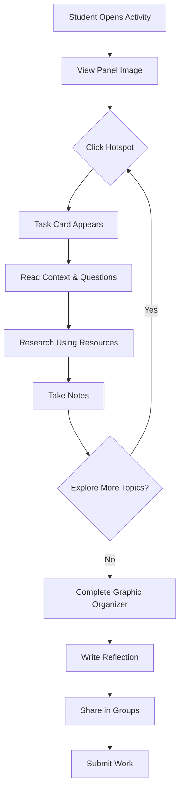

# Interactive Research Activity: "Connecting the Dots" - From History to TRC

## Overview
Students use the "Permanent Guardianship Order" panel as a starting point to research the historical policies and events that created the conditions leading to the Truth and Reconciliation Commission. The activity builds a clear chain of cause-and-effect from the Indian Act through residential schools and the Sixties Scoop to present-day realities, demonstrating why the TRC was necessary.

## Learning Goals
1. Understand the specific historical references on the panel
2. Trace the connection between past policies and 2026 realities
3. Explain why the TRC was created and why it matters

---

## Textbook Reference Guide

**Textbook:** *Aboriginal Peoples: Building for the Future*

| Topic | Textbook Section | Pages |
|-------|-----------------|-------|
| Residential Schools | Chapter 17: Residential Schools | p. 48-49 |
| Criminal Justice System | Chapter 27: Criminal Justice | p. 72-73 |
| Relocation/Centralization | Chapter 19: Relocation from Traditional Lands | p. 52 |
| Life in Cities / Urban Migration | Chapter 30: Life in Cities | p. 80 |

---

## Clickable Research Topics (Hotspots)

Based on the panel content, here are the interactive elements students can click:

### 1. **Bagot Commission (1842-1844)**
- **Research Focus:** What was the Bagot Commission? What were its recommendations?
- **Guiding Questions:**
  - Who was Sir Charles Bagot?
  - What did the commission recommend regarding Indigenous children?
  - How did these recommendations shape Canadian policy?
- **Connection to Panel:** "recommended the forced removal of Indian children from their families in order to assimilate them"
- **Textbook Reference:** See Chapter 17, p. 48 for context on government policy origins

### 2. **Residential Schools - Three Principles**
- **Research Focus:** The three stated goals of residential schools
- **Guiding Questions:**
  - What does "separation of children from their Indian people" mean in practice?
  - What is "socialization into British settler culture"?
  - What does "enfranchisement" mean in this context?
- **Connection to Panel:** Lists the three principles explicitly
- **Textbook Reference:** **Chapter 17, p. 48-49** - "The Purpose of Residential Schools" section

### 3. **1920 - Mandatory Attendance**
- **Research Focus:** The amendment to the Indian Act making attendance compulsory
- **Guiding Questions:**
  - What law made attendance mandatory?
  - What happened to families who resisted?
  - How many children were affected?
- **Connection to Panel:** "In 1920, the federal government tried to 'solve the Indian problem' by making it mandatory"
- **Textbook Reference:** **Chapter 17, p. 48** - Indian Act and government responsibility

### 4. **Conditions in Residential Schools**
- **Research Focus:** Abuse, neglect, and death rates
- **Guiding Questions:**
  - What types of abuse occurred?
  - Why were schools underfunded?
  - What diseases caused the high death rate?
  - What is the estimated number of children who died?
- **Connection to Panel:** "malnourished, overcrowded, poorly monitored... Approximately 50 percent of these children died of disease"
- **Textbook Reference:** **Chapter 17, p. 48-49** - "Life at the schools was often harsh" section; Figure 17-1 showing before/after photos

### 5. **1960s - Schools Begin to Close / Sixties Scoop Begins**
- **Research Focus:** Transition from residential schools to child welfare removal
- **Guiding Questions:**
  - What social changes led to school closures?
  - How did child welfare agencies become the new mechanism of removal?
  - What statistics show the scale of the Sixties Scoop?
- **Connection to Panel:** "The schools began to close in the 1960s. At the same time, child welfare authorities began the mass removal..."
- **Textbook Reference:** **Chapter 7 (Family Life), p. 21** - "Social welfare agencies tried to deal with such problems in the 1960s by removing Aboriginal children..."

### 6. **The Sixties Scoop**
- **Research Focus:** Mass removal of Indigenous children via child welfare
- **Guiding Questions:**
  - Why is it called the "Sixties Scoop"?
  - How many children were taken?
  - Where were they placed?
  - What were the long-term impacts?
- **Connection to Panel:** "This era is known as the 60s Scoop"
- **Textbook Reference:** **Chapter 7 (Family Life), p. 21** - Statistics on Aboriginal children in care (1955: less than 1%, 1964: 34% in BC)
- **External Resource:** [The Canadian Encyclopedia - Sixties Scoop](https://thecanadianencyclopedia.ca/en/article/sixties-scoop)

### 7. **1996 - Last Residential School Closes**
- **Research Focus:** The final closure and its significance
- **Guiding Questions:**
  - Which school was the last to close?
  - What was the government's response?
  - How did survivors react?
- **Connection to Panel:** "The last residential school closed in 1996"
- **Textbook Reference:** Cross-reference with TRC timeline

### 8. **2012 Statistics - Alberta Child Welfare**
- **Research Focus:** Ongoing overrepresentation in child welfare AND criminal justice
- **Guiding Questions:**
  - Why are Indigenous children still overrepresented?
  - What is the "millennial scoop"?
  - How does this connect to overrepresentation in prisons?
- **Connection to Panel:** "In 2012, 68 percent of children involved in child welfare in Alberta were Aboriginal"
- **Textbook Reference:** **Chapter 27, p. 72-73** - "The Poverty Factor" and prison admission statistics table (Figure 27-3)

### 9. **"My son is now a part of this history"**
- **Research Focus:** Intergenerational trauma and the cycle continuing
- **Guiding Questions:**
  - What does this line reveal about the character's experience?
  - How does intergenerational trauma work?
  - What does healing look like?
- **Connection to Panel:** The final emotional line of the document
- **Textbook Reference:** **Chapter 7, p. 21** - "Poverty, high rates of unemployment, and social breakdown have led to problems..." and healing centres

### 10. **Urban Migration / Life in Cities**
- **Research Focus:** Why Indigenous people move to cities and the challenges they face
- **Guiding Questions:**
  - Why do Indigenous people leave reserves for cities?
  - What challenges do they face in urban areas?
  - What is the role of Aboriginal friendship centres?
  - How does isolation from land and community affect identity?
- **Connection to Panel:** Connects to the ongoing displacement and disconnection theme
- **Textbook Reference:** **Chapter 30, p. 80** - "From the Reserve to the City," "Isolation," "Poverty" sections

---

## Activity Structure: "Connect the Dots" Worksheet

### Part A: Decode the Panel (Research Phase)
Students click on hotspots and fill in a structured worksheet:

| Panel Reference | What It Means | Textbook Pages | How It Connects to Today |
|-----------------|---------------|----------------|-------------------------|
| Bagot Commission (1842-1844) | | | |
| Three Principles of Residential Schools | | | |
| 1920 Mandatory Attendance | | | |
| Conditions (abuse, death rates) | | | |
| 1960s - Sixties Scoop begins | | | |
| 1996 - Last school closes | | | |
| 2012 - 68% of child welfare cases | | | |
| "My son is now part of this history" | | | |

### Part B: Trace the Chain of Cause and Effect
Students complete a flow chart showing how each policy/event led to the next:

```
Indian Act (1876)
     |
     v
Bagot Commission recommendations
     |
     v
Residential Schools established
     |
     v
[Student fills in the rest...]
     |
     v
Sixties Scoop
     |
     v
[Student fills in...]
     |
     v
2026 Reality: [What do we see today?]
```

### Part C: Why the TRC?
Based on their research, students answer:

1. **What problem was the TRC created to address?**
2. **How do residential schools and the Sixties Scoop connect to current issues?**
3. **Why is "truth" necessary before "reconciliation"?**
4. **What does this history tell us about why the TRC Calls to Action exist?**

### Part D: Preview - What's Next?
Students write 2-3 sentences predicting what the TRC Calls to Action might address, based on what they've learned.

---

## Printable Worksheet Version

A print-friendly PDF version of the activity includes:

### Page 1: "Decode the Panel" Research Table
- Blank table with columns: Panel Reference | What It Means | Textbook Pages | How It Connects to Today
- **Each row includes the specific textbook page reference pre-filled:**
  - Bagot Commission → See Ch. 17, p. 48
  - Residential Schools (Three Principles) → **Ch. 17, p. 48-49**
  - 1920 Mandatory Attendance → **Ch. 17, p. 48**
  - Conditions in Schools → **Ch. 17, p. 48-49**
  - 1960s / Sixties Scoop → **Ch. 7 (Family Life), p. 21**
  - 1996 Last School Closes → TRC timeline
  - 2012 Statistics → **Ch. 27, p. 72-73**
  - Intergenerational Impact → **Ch. 7, p. 21**
  - Relocation/Centralization → **Ch. 19, p. 52**
  - Urban Migration / Life in Cities → **Ch. 30, p. 80**
- Students fill in by hand while researching

### Page 2: "Trace the Chain" Flow Chart
- Pre-printed flow chart with blanks for students to complete
- Arrows showing cause-and-effect relationships
- **Textbook page references noted at each step** so students know where to look
- Space at bottom for "2026 Reality" summary

### Page 3: "Why the TRC?" Reflection Questions
- Four questions with lined space for written responses
- **Each question includes relevant textbook page references:**
  - Q1: See Ch. 17, p. 48-49 and Ch. 7, p. 21
  - Q2: See Ch. 27, p. 72-73
  - Q3: See Ch. 7, p. 21 (healing centres)
  - Q4: Synthesis question
- Includes a "Key Terms" box at the top for reference

### Page 4: Answer Key / Teacher Notes
- Suggested answers for each section
- Discussion prompts for class debrief

---

## Technical Implementation

### HTML Structure
```
- Main panel image with clickable hotspot overlays
- Side panel or modal for research task cards
- Navigation between topics
- Progress tracker
```

### Features
- **Hotspot highlighting** on hover
- **Task cards** with:
  - Topic title
  - Brief context
  - 3-4 guiding questions
  - Suggested resources (links)
  - Space for notes
- **Progress tracking** (which topics explored)
- **Printable worksheet** option

### Accessibility Considerations
- Keyboard navigation
- Screen reader compatible
- High contrast mode
- Text alternatives for images

---

## Assessment Options

### Formative
- Completion of graphic organizer
- Quality of notes on task cards
- Participation in discussions

### Summative
- Research summary essay
- Timeline project
- Reflection on intergenerational impacts

---

## Resource Links (Suggested)

1. National Centre for Truth and Reconciliation: https://nctr.ca/
2. Legacy of Hope Foundation: https://legacyofhope.ca/
3. CBC Indigenous: https://www.cbc.ca/news/indigenous
4. The Canadian Encyclopedia - Residential Schools: https://www.thecanadianencyclopedia.ca/
5. The Canadian Encyclopedia - Sixties Scoop: https://thecanadianencyclopedia.ca/en/article/sixties-scoop
6. TRC Calls to Action: https://www2.gov.bc.ca/

---

## Mermaid Diagram: Activity Flow


